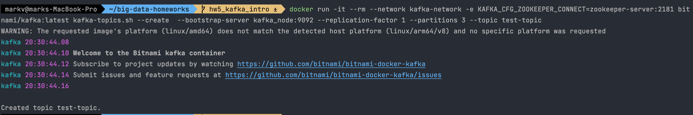
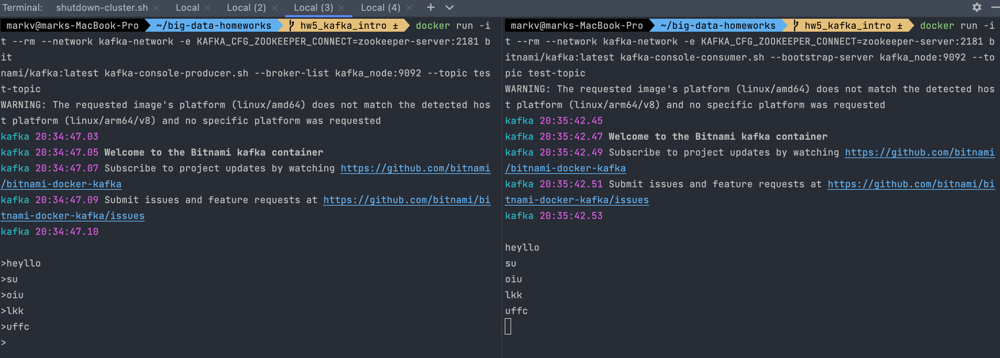

# big-data-homeworks | kafka-intro
HWs for Big Data course UCU.

1. Create cluster:
```
sh ./run-cluster.sh
```



2. Create test-topic:
```
sh ./create_topic.sh
```


3. Try producing/consuming messages:




4. Shutdown cluster:

To shutdown Kafka cluster:
```
sh ./shutdown-cluster.sh
```
