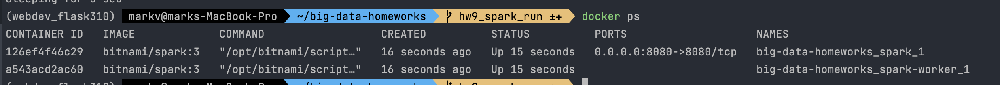
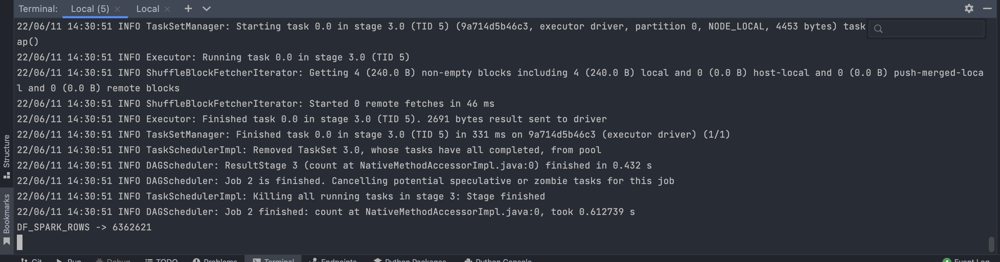

# big-data-homeworks | hw9_launch_spark
HWs for Big Data course UCU.

1. Run cluster
```
sh ./run-cluster.sh
```


2. Move code into the container
```
docker run --rm -it --network spark-network --name spark-submit -v /Users/markv/big-data-homeworks:/opt/app bitnami/spark:3 /bin/bash 
```

3. Submit:
```
cd /opt/app
spark-submit --master local[*] --deploy-mode client SimpleProgram.py
```

4. Results


