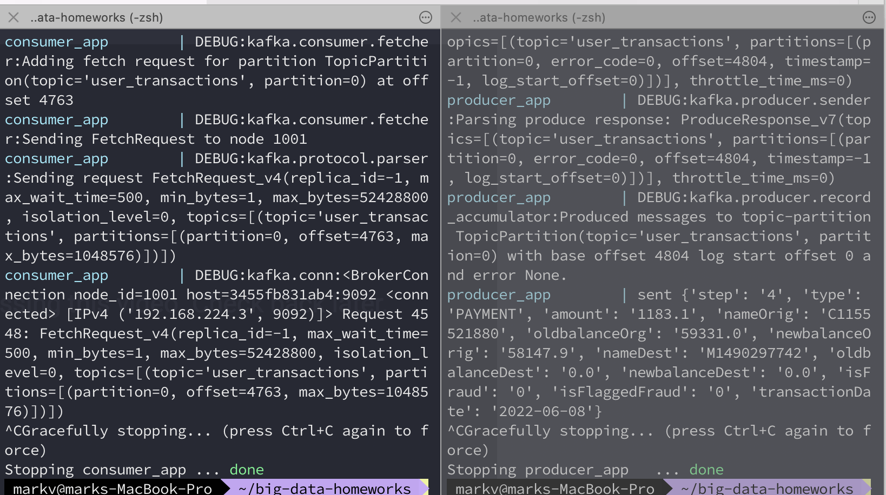
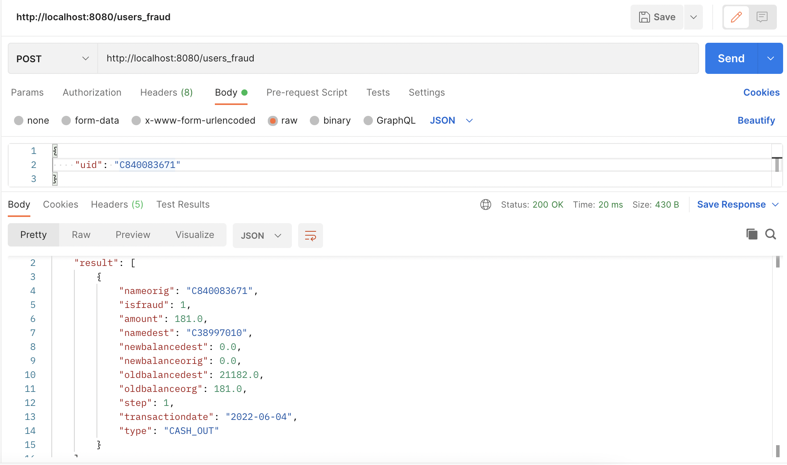
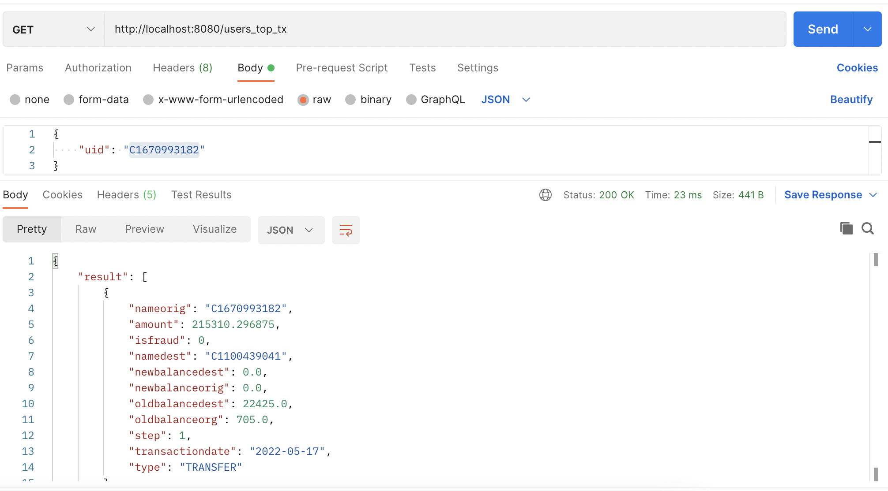
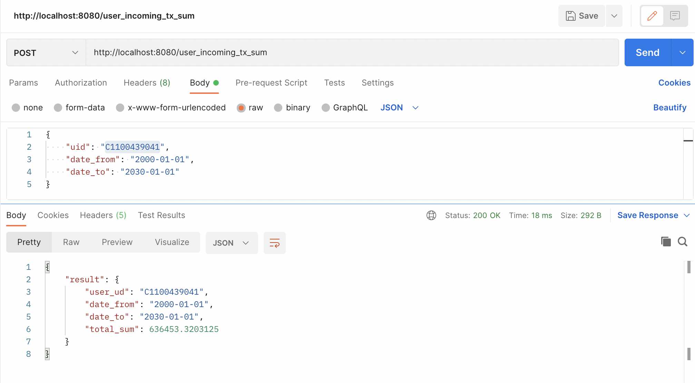

# big-data-homeworks | kafka-cassandra code
HWs for Big Data course UCU.

### Check youtube demo -> https://www.youtube.com/watch?v=PGTRJ9_KH8s

1. Create kafka zookeeper cluster:
```
sh ./run-cluster.sh
```

2. Create cassandra cluster:
```
sh ./run-consumer-app.sh
```

3. Run producer app:
```
sh ./run-producer-app.sh
```

4. Run consumer app:
```
sh ./run-consumer-app.sh
```

5. Run REST api:
```
sh ./run-rest-api-app.sh
```

6. Results:
  -  After producer/consumer ran:


  -  First query
 
  -  Second query
 
  -  Third query
 

