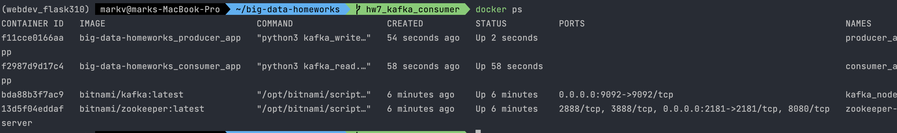
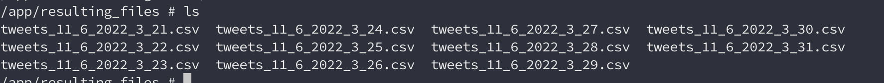
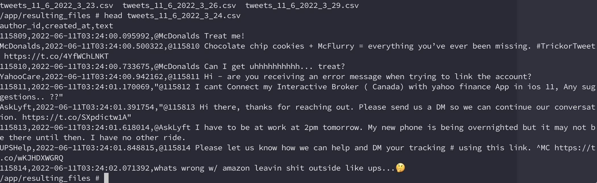
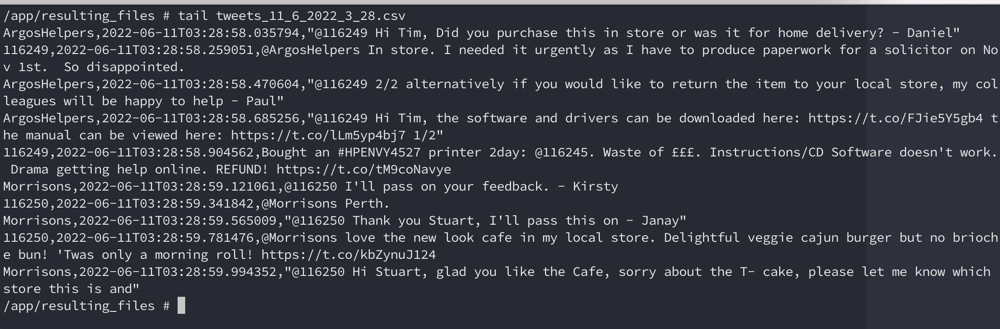

# big-data-homeworks | kafka-consumer
HWs for Big Data course UCU.

1. Create cluster:
```
sh ./run-cluster.sh
```


2. Run consumer:
```
sh ./run-consumer-app.sh
```

3. Run producer app:
```
sh ./run-producer-app-app.sh
```

4. Results:
  -  After producer/consumer ran:


  -  Files generated
 
 
  -  Inside 2 files (head/tail)
 
 

