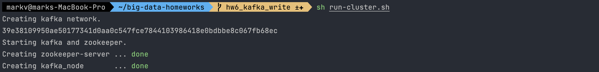
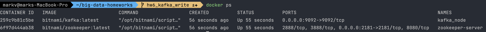
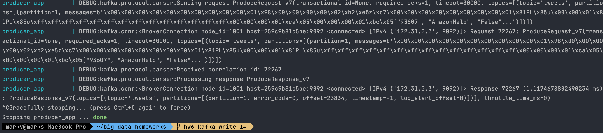
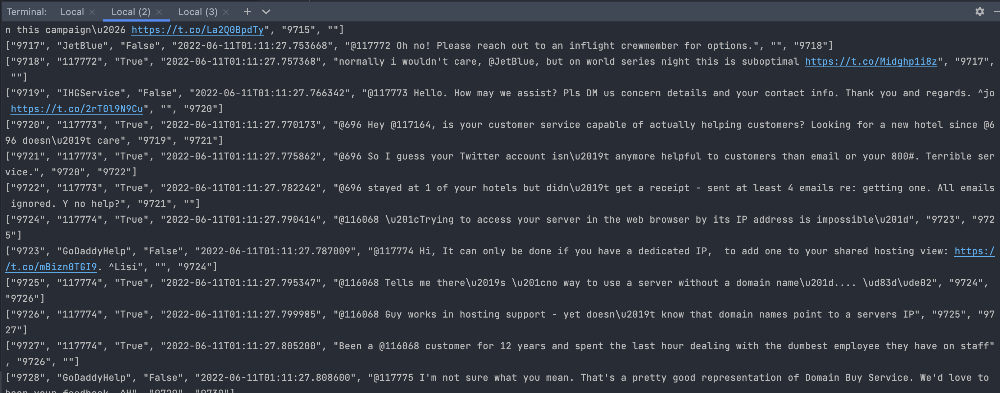
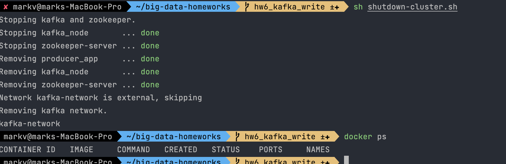

# big-data-homeworks | kafka-producer
HWs for Big Data course UCU.

1. Create cluster:
```
sh ./run-cluster.sh
```




2. Run consumer:
```
sh ./run-cli-consumer.sh
```

3. Run producer app:
```
sh ./run-producer-app.sh
```

4. Results:
  -  Producer ran:

  -  Consumer ran:


5. Shutdown cluster:

To shutdown Kafka cluster:
```
sh ./shutdown-cluster.sh
```

